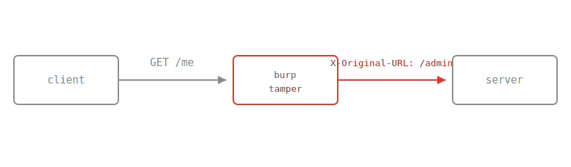

This post exists so I can see, at a glance, everything the renderer
handles. It doubles as a template: copy `posts/syntax-reference/` to a
new slug, gut it, write.

## headings

Use `##`, `###`, `####`. The top `#` is reserved for the title in
`posts.js`, so start body headings at `##`.

## text

Normal prose wraps into paragraphs. You get **bold**, *italic*,
~~strikethrough~~, and `inline code`. Links look like
[this one](https://hackerone.com/bl0rph) and open in a new tab when
they point off-site.

## lists

Unordered:

- recon
- triage
- exploit
- report

Ordered:

1. find the endpoint
2. break the assumption
3. prove impact

## quotes

> A bug is only interesting once you can explain why the developer
> believed it was safe.

## code

Inline like `curl -s $URL | jq .`, or a fenced block with a language
label shown as a caption:

```http
GET /api/v2/users/me HTTP/1.1
Host: target.tld
Authorization: Bearer <redacted>
X-Original-URL: /admin
```

```python
import requests

r = requests.get("https://target.tld/api/v2/users/1", verify=False)
print(r.status_code, r.json().get("role"))
```

## tables

| step | tool        | note                         |
|------|-------------|------------------------------|
| enum | ffuf        | wordlist matters more than threads |
| auth | burp        | replay with a fresh session  |
| poc  | curl        | minimal, copy-pasteable      |

## images

Drop the file next to `index.md` and reference it by filename. Put an
image on its own line and the alt text becomes a caption:

``

Rendered, that looks like this:



Any format the browser understands works: `.png`, `.jpg`, `.svg`,
`.gif`. Keep them next to the post's `index.md`.

Control the display width with a `{...}` after the image. A bare number
is a fraction of the text column (`1` = full width), or use `%`/`px`:

`{width=0.6}` &nbsp; `{width=120%}`

{width=0.6}

## rules

Separate movements with a horizontal rule:

---

That is the full vocabulary. If a post needs more than this, it probably
needs to be shorter instead.
